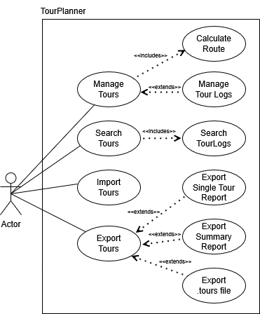
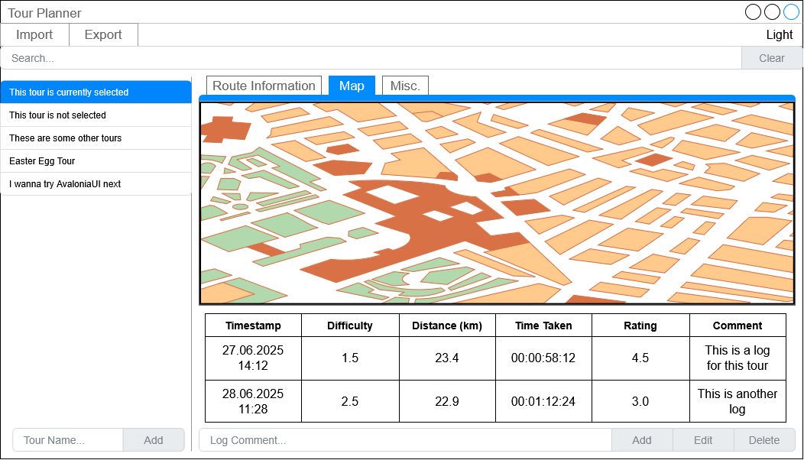
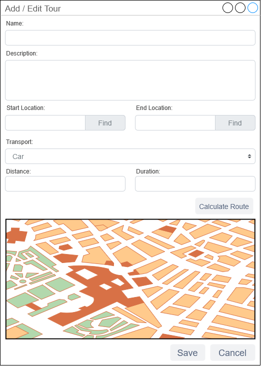
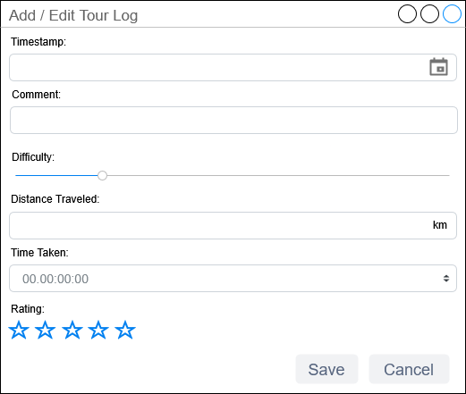
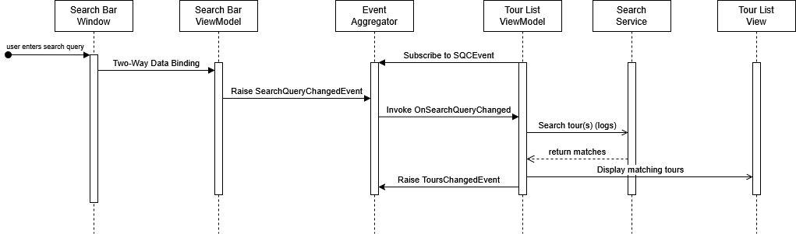

# TourPlanner - Final HandIn
Karlheinz Lunatschek & David Zeugner

## Architecture
As required in the specification for this project, **TourPlanner** is a Windows Presentation Foundation (WPF) GUI application that uses the `MVVM pattern` (Model-View-ViewModel).  
The application also implements a `Layered Architecture` to separate certain business areas of the application from others. For example, requests to external services (such as the REST API, OpenRouteService API, etc.) are outsourced to the Data Access Layer (DAL).  
The UI components are, as prescribed by MVVM, separated from and independent of the rest of the application; the ViewModels implement the logic belonging to the UI without being directly dependent on it, so that they could also be used with other UI frameworks; the business logic for data processing and other operations is also located in its own layer.  
Furthermore, there are services such as the configuration management `TourPlannerConfig.cs`, which span all layers.

The logic for data persistence is outsourced into a completely separate solution, `TourPlanner.RestServer`. The frontend application communicates with the backend via a RESTful API, which is responsible for the saving/updating/deleting of data in a PostgreSQL database.  
The model classes are also outsourced into their own solution, `TourPlanner.Model`, and are used by both `TourPlanner` and `TourPlanner.RestServer`.

### Restrictions / Trade-offs

We have consciously (and, probably, in some cases unconsciously too) violated some of the best practices and design patterns we just mentioned (exactly which ones we implemented will be discussed later) at certain points. For example, some model classes in `TourPlanner.Model` implement `INotifyPropertyChanged` and thereby include parts of the business logic. This was a pragmatic decision to avoid having the ViewModels re-implement all properties of the models, which would have resulted in a significant amount of duplicate code.

The CodeBehind file of `Map.xaml` contains business logic for initializing the WebView and the services that manage it (a violation of the MVVM pattern). Outsourcing this logic from the CodeBehind would have lead to a massive increase in the complexity of the application, with little to no benefit, since the initialization logic for, for example, WebView2 is so specific to the UI framework being used that it cannot realistically be reused elsewhere.

### Special Features / Challenges
One major challenge was implementing the logic for controlling the WebView (and thus, the map) while adhering to the `MVVM pattern`. To interact with the map (which resides within a WebView2), certain methods from `Microsoft.Web.WebView2` need to be called (e.g., `EnsureCoreWebView2Async`, `ExecuteScriptAsync`, `CapturePreviewAsync`, etc.). However, best practices dictate that we should not introduce direct dependencies on these components within the ViewModel, and the logic should also not be implemented in the code-behind file.
Therefore, we implemented a service class, `WebViewService.cs`, which implements the `IWebViewService` interface and provides methods to interact with the WebView2 in the view. Other classes can then use this interface as an abstraction to send commands to the WebView without being directly dependent on it.
We are aware that this solution is not entirely clean either. Service classes should, strictly speaking, not have dependencies on UI components such as WebView. To eliminate this dependency, we could theoretically have introduced another abstraction layer for the WebView2 control and made `WebViewService.cs` dependent on that. In our view, however, this would have introduced a lot of unnecessary complexity with little added benefit, since `WebViewService.cs` is already so specifically tailored to the WebView2 components that such a dependency can be justified.

A similar problem arose in cases where we needed WPF functionality within the ViewModels (such as spawning new windows like `EditTour(Log)Window`, creating `MessageBox`es, closing windows, etc.). The MVVM pattern, however, forbids direct dependencies of ViewModels on the View. For this reason, we implemented a `WpfService.cs`, which—using the `IWpfService.cs` interface—provides an abstraction layer for our ViewModels and other classes.
This class is therefore directly dependent on WPF (`System.Windows`) (which is also not entirely in line with best practices—but since the functionality is already completely specific to WPF, we chose to forego abstracting WPF components to avoid unnecessary complexity) and orchestrates various UI commands. Other classes can then use this service to access WPF functionalities without being directly dependent on `System.Windows`.

Another significant challenge was implementing communication between the various classes in accordance with SOLID principles and loose coupling between components. We will revisit this in the section on `Design Patterns`.

### Class Diagram

The following class diagram provides an overview of the application's architecture:

## Use Cases

This use case diagram illustrates the basic functionalities our application offers to a user. It should be noted that not every function of the application is displayed here, in order to avoid overloading the diagram.

## UI / UX

After starting the application, the `MainWindow` - the centerpiece of the application - opens:

- By clicking the `Import` button in the top left, the user can import tours (and logs) from a `.tours` file.
- By clicking the adjacent `Export` button, the user can export all tours (and logs) as a `.tours` file or generate a tour summary PDF report.
- In the top right, there is a toggle that allows the user to activate the application's dark mode (for some reason, this toggle is not displayed correctly in the PNG - the .drawio file does contain the toggle).
- Below that is the search bar - here the user can enter a search term, and only those tours whose details (or logs) contain the search term are displayed in the tour list to the left.
- As just mentioned, the left side contains a list of tours - by clicking on one, it is selected and its details are displayed on the right half of the screen.
- The "Map" tab displays a map showing the starting point, destination, and route of the tour.
- The "Route Information" tab contains general information about the route, such as name, description, duration, means of transport, etc.
- The "Misc." tab contains attributes such as popularity, child-friendliness, or the AI summary.
- Below the tabs is a table showing all logs associated with the selected tour.

A new tour can be added by entering a tour name in the "Tour Name..." field at the bottom left and then clicking the "Add" button.  
A new tour log can be added by entering a comment in the "Log Comment" field at the bottom center and then clicking the "Add" button.

A tour can be deleted or edited by right-clicking its entry in the list and then selecting "Edit" or "Delete". Exporting the tour as a PDF document is also available here.  
Tour logs can be edited or deleted by clicking the log entry in the table and then clicking the "Edit" or "Delete" button at the bottom right.

When a new tour is added or an existing one is edited, the `Edit Tour Window` opens. This window contains text fields that allow the user to describe the tour.
Before the tour can be saved, a start and end location must be specified, and the "Find" button next to each must be clicked - this performs geocoding, converting the location string entered by the user into coordinates.
Once this is done, the "Calculate Route" button can be clicked. This calculates the route between the start and end points and displays it on the map. The "Distance" and "Duration" fields are then filled in automatically.

Only after the route has been calculated can the tour be saved.

When a tour log is added or edited, the `Edit Tour Log Window` opens. This window also contains the necessary text fields for describing the log.
In the timestamp field, the user can select the date and time of the recording. The difficulty is set using a slider, which can take integer values from 1 to 5.  
The rating is specified in the form of stars, with values ranging from 0.5 to 5 stars.

In both dialog windows, clicking "Save" will save the changes, while clicking "Cancel" will discard them.

## Library Decisions
Below, we present the most relevant libraries/dependencies (not a complete list!) used in our project, explaining why they were necessary or why we chose them:

- **NUnit / NSubstitute**
  - These libraries are used for unit testing in our project (we'll explain more about this below). We chose them because both of us had previous experience with NUnit / NSubstitute.
- **Npgsql.EntityFrameworkCore.PostgreSQL**
  - Since we chose to use a PostgreSQL database together with Entity Framework Core, we needed this library to allow both to work together.
- **Newtonsoft.Json**
  - We could have used Microsoft’s standard JSON library, but according to our research, Newtonsoft.Json is somewhat faster, offers a few more features, and is (in our opinion) more convenient to use.
- **WPF-UI**
  - This is a UI library for WPF that provides the application with a modern (Windows 11-like) style, as well as additional new UI components.
  - We chose this library because we liked its design best, it has "okay-ish" documentation, and it is both popular and well maintained.
- **Extended.Wpf.Toolkit**
  - During development, we noticed that a few UI components we wanted to use were missing. For example, a date picker that also allows time selection or a TimeSpan picker (a textbox that accepts/displays a timespan).
  - Extended.Wpf.Toolkit adds a range of additional controls for WPF and is a very well-known, well-maintained project.
- **iText7**
  - We use this library to generate PDF documents. This choice was mainly due to the fact that neither of us was familiar with PDF libraries, and iText7 was the one covered in the SWEN course sessions.
  - Online research showed that this library is well maintained and comparatively easy to use. We use it only in `PdfService` (and deliberately did not add an additional abstraction layer for this library, since it is used only in a service that is highly specific to iText7 anyway).
- **log4net**
  - We chose this library mainly because it was covered during the course. I also have private experience with NLog; in practice, all major logging libraries work nearly identically anyway.
  - Since we introduced an abstraction layer for logging, the logging framework can also be easily swapped at any time.
- **Microsoft.Extensions.\***
  - We use various abstractions provided directly by Microsoft, such as for dependency injection or configuration.
  - There are of course third-party solutions here as well, but Microsoft’s solutions are essentially the industry standard in the .NET world, and are well maintained, which is why we chose them.

## Design Patterns

### MVVM Pattern
No surprise here (and since this was a requirement for this project), our application clearly implements the MVVM (Model-View-ViewModel) pattern.

### Repository Pattern
For communication with the external database, we use the Repository Pattern in `TourPlanner.RestServer`. The logic for database communication is encapsulated in `TourLogRepository.cs` and `TourRepository.cs`. Other classes can use the repository interfaces as an abstraction for database operations.

### Event Aggregator Pattern
As mentioned above, one of the biggest challenges was enabling effective communication between various components of our application while adhering to best practices and promoting loose coupling.

There are several events in our application that multiple components need to react to. For example: when the user selects a new tour (the map needs to update, new information needs to be displayed, ...), when a search is performed (run the search, tour list is filtered, ...), when new tours are added or deleted (UI updates, database operations, ...), etc. etc.

Originally, we used a very basic form of the Observer Pattern for this communication. For example, `TourListViewModel.cs` exposed a `TourChangedEvent` that could be subscribed to by other classes interested in being notified when the user selected a different tour in the tour list (and we did the same for a lot of other events too). However, this resulted in many unnecessary dependencies between components, whose sole purpose was event exchange.
As a workaround, we then created dedicated services, like a `SelectedTourService.cs`, which always contained information about the currently selected tour and could be used by all components interested in the currently selected tour, to avoid direct dependencies on `TourListViewModel` (and did something similar for other events too e.g., `SearchQueryService`). But this approach didn't scale well - as the number of events grew, more and more such services were required.

Realizing that this is likely a common problem in UI application development, we did some research and came across the Event Aggregator Pattern. We implemented a central class (of course, against an interface) that centrally manages the publishing, subscribing, and unsubscribing of various events (defined in `TourPlanner.Model`). With this system, components can communicate through a consistent infrastructure without being directly dependent on each other. Since the event classes themselves are defined in `TourPlanner.Model`, the data carried by events can be structured completely flexibly.

### Dependency Injection / Singleton Pattern
We use a dependency injection framework to centrally manage dependencies for our classes and automatically provide them as needed. Many of our services are managed as singletons, meaning only one instance exists per application lifetime, thereby implementing the Singleton Pattern.

### Command Pattern
We employ the Command Pattern to decouple the View from the ViewModel. Instead of directly connecting UI events to code, the command properties of UI elements are bound to methods in the ViewModel that implement the `ICommand` interface. For this purpose, we implemented `RelayCommand.cs` and (for asynchronous operations) `RelayCommandAsync.cs`. Outside of an academic context, it would probably make sense to use an existing library implementation rather than writing these ourselves.

### Facade Pattern
The Facade Pattern is used to provide an easy and unified interface to a complex underlying subsystem. We use this pattern, for example, in `WpfService`, `OrsService`, `AiService`, and `PdfService` by hiding the underlying library details from the rest of the application and instead offering high-level abstractions through these classes (and their respective interfaces).

### Adapter Pattern
The Adapter Pattern provides an abstraction layer between our code and an external, often incompatible, system.
We implement this in the `FileSystemWrapper` to provide our classes with a testable abstraction of the file system and to enable effective unit testing.

## Unit Tests

Writing unit tests this semester proved to be more challenging due to the increased complexity of the project. However, thanks to best practices implemented early on - such as dependency injection and the use of the design patterns described above - making the code testable involved far less refactoring work than it did last year.

We would also like to be transparent and disclose that, after writing some unit tests ourselves (to understand the underlying concepts, especially around MVVM unit testing), we created many of the remaining unit tests in this project with the help of artificial intelligence. We carefully reviewed, understood, and, where necessary, adapted all AI-generated tests. We also made sure we understood all code we received from the AI and checked their business value.

### Challenges
As mentioned above, in some places (to avoid unnecessary complexity), we intentionally decided not to introduce additional abstraction layers. For example, `WebViewService` relies directly on the WebView2 component, `WpfService.cs` directly on WPF UI components, and `PdfService.cs` directly on the iText7 library. As a result, some of these service classes are basically untestable with unit tests, so we have not written tests for them.
It's worth considering whether introducing abstractions for these components (e.g., via interfaces) would be beneficial to make these classes unit-testable, especially since they encapsulate some complex logic. In our opinion, however, this would go beyond the scope of the coursework.

Another problem was that, especially since asynchronous programming was relatively new for us, we sometimes used `async void` methods (with appropriate error handling) in the application, which cannot be properly unit tested with NUnit. We refactored some of these methods, but in cases where refactoring would have required too much effort, we simply chose not to unit test those parts.
Next time, we think it would be best to just avoid using `async void` methods altogether from the start, since (though there seem to be differing opinions on this) they are generally not considered best practice.

## Unique Features

We have implemented two unique features in our project:

### 1. AI Integration
We integrated ✨AI✨ to enhance the user experience. In the `Misc.` tab of the tour details view, the user can click the "Generate" button to receive a summary about the selected route and its associated log entries. This summary is generated by a Large Language Model via OpenRouter (by default GPT 4.1).

### 2. Dark Mode
Since David had already used an AI integration as a unique feature last semester, he found it a bit boring to simply recycle the idea for this project and thus we decided to go a step further and also implement a dark mode. The dark mode can be toggled on or off using the switch located at the top right of the main window.

## Search | Sequence Diagram
As required, we are also providing a sequence diagram for the application's search functionality. While it might have fit better earlier in this document, we wanted to wait until after explaining the Event Aggregator Pattern since it plays a key role here.
Now that the necessary background has been covered, here is the sequence diagram for the search feature:

**Note:** The "Raise ToursChangedEvent" is not crucial for this workflow - displaying the matching tours also relies on two-way data binding. However, we included it in the diagram to illustrate how other components are informed too about changes in the tour list.